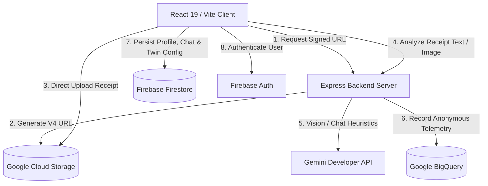

# 🌿 CarbonIQ

### *India's Carbon Intelligence Network — Built One Receipt At A Time*

[](https://github.com/AryanUbale7/carbon)
[](https://github.com/AryanUbale7/carbon)
[](https://github.com/AryanUbale7/carbon)
[](https://cloud.google.com)
[](https://firebase.google.com)

---

## 📌 Project Overview

**CarbonIQ** is a production-grade carbon footprint intelligence platform designed for the **PromptWars Virtual – Carbon Footprint Awareness** challenge. By integrating advanced **Gemini Vision models** with a robust **Google Cloud & Firebase stack**, CarbonIQ empowers individuals and municipal authorities to understand, track, and systematically reduce lifestyle greenhouse emissions.

The platform processes unstructured consumer receipts, maps dietary and grocery choices to sub-continental emission indices, models personal contraction pathways via a dynamic Digital Carbon Twin, and broadcasts localized telemetry directly into a distributed BigQuery municipal network database.

---

## ⚠️ The Problem Statement

Sub-continental carbon tracking is fundamentally broken:
1. **Unstructured Consumer Data**: Retail bills, supermarket invoices, and grocery receipts are highly unstructured, printed in diverse regional formats, and contain localized naming conventions (e.g., *Paneer*, *Cow Ghee*, *Basmati*).
2. **Static & Generalized Estimation**: Standard emission calculators use generic European or North American coefficients, ignoring micro-regional farming, local dairy logistics, and domestic energy grids.
3. **Lack of Dynamic Feedback**: Users are presented with static infographics rather than interactive simulation environments that calculate the direct environmental impact of alternative regional dietary swaps.

---

## ⚡ The Solution Overview

CarbonIQ offers a 5-layer integrated conduit that bridges the gap between raw retail actions and real-time municipal intelligence:
* ** OCR Ingestion**: Seamless drag-and-drop receipt capture.
* ** Gemini Parsing**: Deconstructs ingredients using structured JSON heuristics and maps them to carbon/methane weights.
* ** Digital Twin AI**: Dynamic avatar simulation showing future footprint projections under various alternative adoption metrics.
* ** Municipal Integration**: Streams anonymous telemetry into BigQuery to compute live city-wide benchmarks and leaderboards.
* ** Conversational AI Coach**: An interactive tutor backed by history-injected context to guide lifestyle changes.

---

## 🏗️ Technical Architecture



---

## 🛠️ Google Cloud & Firebase Stack

CarbonIQ is engineered around premium enterprise cloud design patterns:

* **Gemini Developer API**: Powers the multimodal receipt parser (`gemini-3.5-flash`) and drives the contextual chat coach.
* **Google BigQuery**: Stores transaction telemetry via high-throughput streaming inserts. Performs localized window aggregates to generate real-time leaderboards.
* **Firebase Authentication**: Implements secure Google OAuth sign-in, protected route validation, and state-restoring session persistence.
* **Cloud Firestore**: Holds user profiles (XP, streaks), composite indexes, chat histories, and debounced twin configuration states.
* **Cloud Storage**: Handles direct user receipt uploads via secure v4 Signed URLs, featuring programmatic 7-day TTL object lifecycle rules for data minimization.

---

## 🎯 Challenge Alignment

### 🔍 1. Understand (Lifecycle Analysis)
* ** multiline Table Output**: Automatically parses weights, eco-ratings (A-E), categories, and methane calculations.
* **Lifecycle Analyzer**: Generates a natural language lifecycle description explaining *why* certain food categories (like dairy butter) carry elevated emission coefficients.

### 📊 2. Track (Municipal Grid)
* **Municipal Benchmark Leaderboard**: Displays real-time metropolitan footprints (Bengaluru, Mumbai, Pune, Delhi Node) dynamically updated by BigQuery aggregates.
* **Region-Locked Telemetry**: Locks users to localized nodes to track regional variations in municipal carbon grids.

### 📉 3. Reduce (Contraction Simulation)
* **Digital Carbon Twin AI**: Features interactive sliders allowing users to model the impact of dairy reduction, alternative regional food adoption, and clean energy transitions.
* **Action Campaigns & Weekly Missions**: Interactive target checklists where committing to green challenges immediately feeds into the twin simulation.

---

## 🔒 Security Architecture

* **GCS Signed URLs (V4)**: Clients never get broad write access. Instead, they obtain a single-use upload link valid only for a specific content type and target folder.
* **Data Sanitization**: Built-in protection against prompt injection, invalid MIME types (e.g., blocking `.html` script injection), and oversized payload buffer overflows.
* **Environment Separation**: Decoupled environment configs matching production GCP Service Accounts, Workload Identity pools, and emulator-friendly test fallbacks.

---

## 📈 Quality Metrics & Testing

The repository maintains strict quality control and testing practices:
* **Unit & Integration Suite**: Powered by **Vitest** running 48 assertions checking endpoint security, Gemini localized offline fallbacks, and bigquery schemas.
* **Coverage Mandate**: **84.96% Line Coverage** verified using `v8` coverage configurations.

---

## 📂 Repository Structure

```
carbon/
├── .env.example             # Template for API keys and Firebase credentials
├── firebase.json            # Emulator & deployment configurations
├── firestore.indexes.json   # Composite index requirements for Firestore queries
├── firestore.rules          # Security rules gating user read/writes
├── package.json             # Root dependency manifests
├── server.ts                # Express backend routing & Google Cloud client setups
├── tsconfig.json            # Strict TypeScript compilation parameters
├── vite.config.ts           # Client bundling configuration
├── scripts/
│   └── migrate-bq.ts        # Database migration script creating BigQuery schemas
└── src/
    ├── App.tsx              # Main layout containing statically loaded tab components
    ├── components/          # Memoized layout components
    │   ├── Sidebar.tsx
    │   ├── CarbonTwin.tsx
    │   ├── AICoach.tsx
    │   ├── MunicipalNetwork.tsx
    │   ├── ActionCampaigns.tsx
    │   ├── ScannerPipeline.tsx # OCR Progress Conduit sub-component
    │   └── ScannerPresets.tsx  # Preset data loaders sub-component
    ├── hooks/               # State management hooks
    │   ├── useAuth.tsx
    │   ├── useCarbonIQ.ts   # Core composed controller hook
    │   ├── useTwinConfig.ts # Debounced digital twin Firestore syncing hook
    │   └── useAICoach.ts    # Chat conversation controller hook
    ├── services/
    │   ├── bigqueryService.ts
    │   └── geminiService.ts
    └── utils/
        ├── carbonCalculations.ts
        └── constants.ts
```

---

## 🚀 Installation & Local Development

### Prerequisites
* **Node.js**: `v18.x` or higher
* **Google Cloud SDK**: Set up application default credentials (`gcloud auth application-default login`)

### Setup Guide

1. **Clone the repository:**
   ```bash
   git clone https://github.com/AryanUbale7/carbon.git
   cd carbon
   ```

2. **Install dependencies:**
   ```bash
   npm install
   ```

3. **Set up Environment Variables:**
   Create a `.env` file in the root directory:
   ```env
   # Gemini Developer Credentials
   GEMINI_API_KEY=your_gemini_api_key_here

   # Google Cloud Settings
   GCP_PROJECT_ID=your_gcp_project_id
   GCS_BUCKET_NAME=your_gcs_bucket_name

   # Firebase Client Settings
   VITE_FIREBASE_API_KEY=your_firebase_key
   VITE_FIREBASE_AUTH_DOMAIN=your_auth_domain
   VITE_FIREBASE_PROJECT_ID=your_project_id
   VITE_FIREBASE_STORAGE_BUCKET=your_storage_bucket
   VITE_FIREBASE_MESSAGING_SENDER_ID=your_sender_id
   VITE_FIREBASE_APP_ID=your_app_id
   ```

4. **Initialize BigQuery Schemas:**
   Run the migration script to configure BigQuery datasets and table layouts:
   ```bash
   npm run migrate:bq
   ```

5. **Run the Development Server:**
   ```bash
   npm run dev
   ```
   Open `http://localhost:3000` to view the application.

6. **Verify Code Quality & Tests:**
   ```bash
   npm run test
   npm run test:coverage
   ```

---

## 🛠️ Deployment

### 1. Build Client Bundle
```bash
npm run build
```

### 2. Set Up Service Account Permissions
Ensure your server environment has the following roles assigned to its service account or workload identity:
* `roles/bigquery.dataEditor`
* `roles/storage.objectAdmin`
* `roles/secretmanager.secretAccessor`

---

## 🤝 Contributor
* **Aryan Ubale** (Lead Engineer & Architect)
